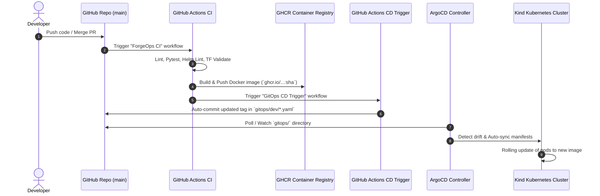

# GitOps Continuous Deployment & Operational Runbook

This document details the automated GitOps continuous deployment pipeline and provides operational procedures for managing cluster state via ArgoCD and Sealed Secrets.

---

## 🔄 GitOps Pipeline Flow



---

## 🛠️ Operator Runbook

### 1. Accessing ArgoCD UI
```bash
# Port-forward ArgoCD server UI to localhost:8080
kubectl port-forward svc/argocd-server -n argocd 8080:443

# Retrieve initial admin password
kubectl -n argocd get secret argocd-initial-admin-secret -o jsonpath="{.data.password}" | base64 -d
```
Navigate to `https://localhost:8080` (Username: `admin`).

### 2. Manually Triggering ArgoCD Sync
If auto-sync is disabled or you wish to force immediate reconciliation:
```bash
argocd app sync api-service-dev
argocd app sync worker-service-dev
```

### 3. Checking Sync Status & Drift
```bash
argocd app get api-service-dev
kubectl get pods -n forgeops-dev
```

### 4. Sealed Secrets Decryption Troubleshooting
If a pod cannot access database secrets:
1. Verify the `SealedSecret` resource status:
   ```bash
   kubectl get sealedsecrets -n forgeops-dev
   ```
2. Check `sealed-secrets-controller` logs:
   ```bash
   kubectl logs -n kube-system -l app.kubernetes.io/name=sealed-secrets
   ```
